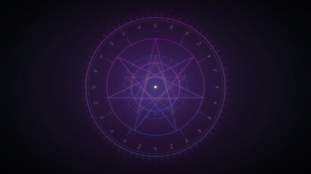
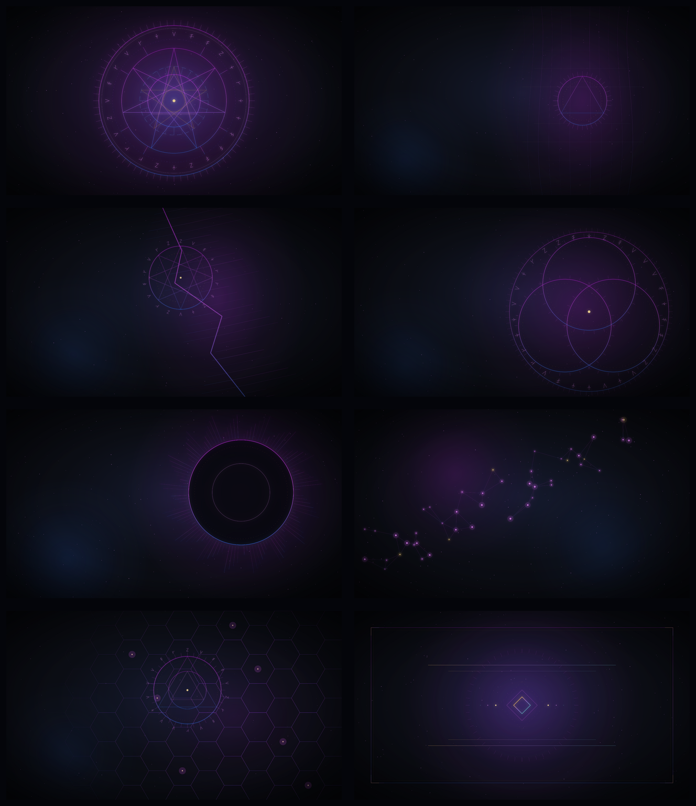

# Leybound for Omarchy

Leybound is a restrained arcane dark theme for [Omarchy](https://omarchy.org/). It pairs a magenta-to-blue energy gradient with translucent shell surfaces, readable neutrals, selective gold accents, and eight procedural 4K wallpapers.



## Install

Once this repository is published, pass its real Git URL to Omarchy:

```bash
omarchy theme install <git-repository-url>
```

The repository name `omarchy-leybound-theme` makes Omarchy install and apply it as `leybound`.

### Manage the theme

```bash
# Apply it again
omarchy theme set leybound

# Pull updates for all Git-installed themes
omarchy theme update

# Remove it safely after switching away
omarchy theme set tokyo-night
omarchy theme remove leybound
```

## What Leybound themes

| Surface | Treatment |
| --- | --- |
| Desktop and supported apps | Semantic dark palette generated from `colors.toml` |
| Omarchy shell | Bar, controls, launcher, menu, lock, notifications, popups, and tooltips |
| Terminals | Omarchy-generated colors for Alacritty, Foot, Ghostty, and Kitty |
| Icons and keyboard | Yaru Magenta icon hint and arcane-magenta RGB accent |
| Backgrounds | Eight deterministic 3840×2160 sRGB PNGs |

The shell stays quiet at rest. The arcane gradient appears around active or selected elements; gold is reserved for warnings and time-sensitive states.

## Wallpapers



1. **Sigil** — the collection's centered ceremonial anchor.
2. **Veil** — flowing energy with a workspace-safe left side.
3. **Rift** — a diagonal fracture and compact seal.
4. **Summoning** — overlapping ritual circles with dense rune work.
5. **Eclipse** — an offset dark orb with an arcane corona.
6. **Constellation** — a restrained star map with rare gold nodes.
7. **Leylines** — a right-weighted lattice and convergence seal.
8. **Grimoire** — a framed, book-like ceremonial composition.

Cycle them with:

```bash
omarchy theme bg next
```

## Compatibility and security boundary

Leybound follows Omarchy's current Git-installed theme trust boundary. The repository intentionally contains no Lua, terminal configuration, or `vscode.json` overrides. Omarchy generates those restricted files from the semantic palette on the user's machine.

This means the public theme provides consistent colors to supported terminals and applications, but it does **not** install custom terminal behavior, application commands, Hyprland rules, or Neovim code. See Omarchy's [theme documentation](https://github.com/basecamp/omarchy/blob/quattro/docs/theming.md) for the current staging rules.

The hand-written `shell.<section>.toml` files are color and presentation data accepted by that boundary. `shell.leybound-signature.toml` reserves optional color tokens for future companion plugins; it does not execute code.

## Companion plugins

Two optional visual extensions are planned separately:

- **Leybound Runes** — runic workspace indicators.
- **Leybound Mana** — mana-style volume and brightness OSD.

They are **coming soon**. No companion plugin is required for this theme, and no plugin URL is published yet.

## Customize

Add personal backgrounds without editing the Git checkout:

```bash
mkdir -p ~/.config/omarchy/backgrounds/leybound
cp /path/to/background.png ~/.config/omarchy/backgrounds/leybound/
```

Then cycle backgrounds with `omarchy theme bg next`.

For local palette experiments, edit `~/.config/omarchy/themes/leybound/colors.toml` and reapply the theme. `omarchy theme update` may overwrite tracked edits, so keep lasting personal changes in a separate fork.

## Troubleshooting

**The theme does not appear after installation**

```bash
omarchy theme current
omarchy theme set leybound
```

**The shell still shows old colors**

Reapply the theme first. If the shell did not hot-reload, restart it:

```bash
omarchy theme set leybound
omarchy restart shell
```

**A terminal has the palette but not custom transparency or behavior**

That is expected. Git-installed themes cannot supply terminal configuration files; Omarchy generates safe color-only terminal configs from `colors.toml`.

## Development provenance

The wallpaper PNGs are deterministic renders from a Python-to-SVG generator stored under `.development/`. Omarchy's current installer ignores hidden repository directories during theme staging, so the generator remains available to contributors without entering the active theme.

Regeneration instructions and expected tools are in [`.development/README.md`](.development/README.md).

## License and attribution

Leybound's theme configuration, documentation, and procedural wallpaper assets are released under the [MIT License](LICENSE), copyright © 2026 Diango.

The palette is inspired by Diango's **Evolution Card Game** design system. The wallpapers are original procedural compositions and do not copy game artwork.

Leybound is an independent community theme for [Omarchy](https://omarchy.org/), which is created by Basecamp and licensed separately. This repository does not claim ownership of or affiliation with Omarchy or Basecamp.
